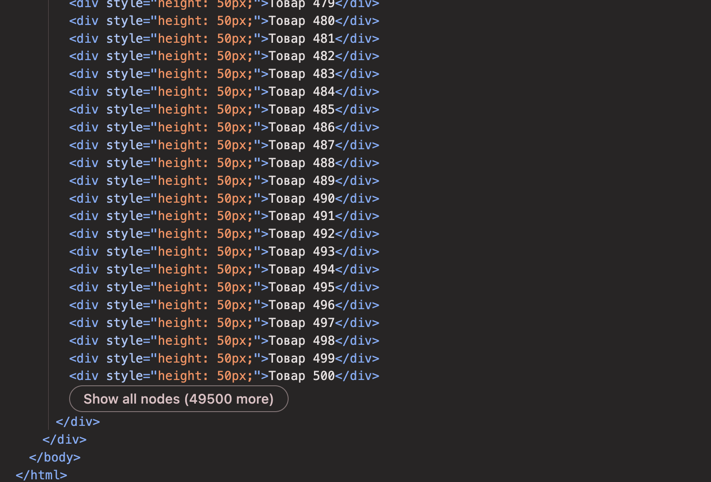
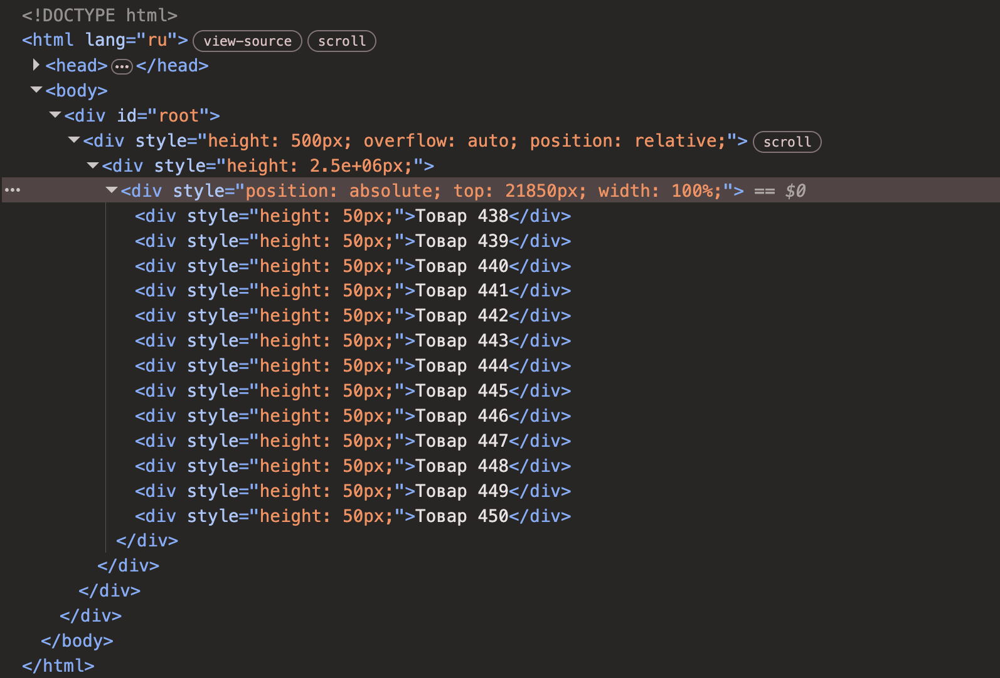

## Демо: B2B-платформа управления дистрибуцией и заказами

**Стек:** React · TypeScript · TanStack Query · Webpack · NestJS · Prisma · PostgreSQL · FSD · Docker

### Ключевые технические решения

- **Кастомная виртуализация каталога без сторонних библиотек** — рендерится только видимое
  окно (`scrollTop` → диапазон индексов → срез списка + абсолютное позиционирование со
  spacer'ом, overscan для плавности). **~12 DOM-узлов вместо 50 000** при 50 000+ товарах.
- **Серверная offset-пагинация с бесконечным скроллом** (NestJS + Prisma + PostgreSQL) —
  данные грузятся порциями по мере скролла, а не все 50 000 сразу: быстрый первый экран,
  меньше нагрузки на сеть и память.
- **Data-layer на TanStack Query** — `useInfiniteQuery` с отменой устаревших запросов через
  `AbortSignal` при быстром скролле: устранена гонка запросов (видно `(canceled)` в Network),
  стоп-условие пагинации через `getNextPageParam`.
- **Переиспользуемый generic-компонент `VirtualList<T>`** — развязан от доменного типа.
- **FSD-архитектура** — app / pages / widgets / features / entities / shared.

---

### Метрики виртуализации

|                   | DOM-узлов |
| ----------------- | --------- |
| Без виртуализации | 50 000    |
| С виртуализацией  | ~12       |

**До** (обычный рендер):



**После** (VirtualList):



---

### Запуск

Требуется Node 22+, pnpm, Docker.

```bash
# 1. переменные окружения
cp .env.example .env

# 2. инфраструктура (PostgreSQL + Redis) в контейнерах
docker compose up -d

# 3. зависимости
pnpm install

# 4. схема БД + тестовые данные (50k товаров)
cd server && npx prisma db push && npx tsx prisma/seed.ts && cd ..

# 5. клиент + сервер одной командой
pnpm dev
```

Полностью в контейнерах (API + инфраструктура):

```bash
docker compose -f docker-compose.full.yml up --build
```
