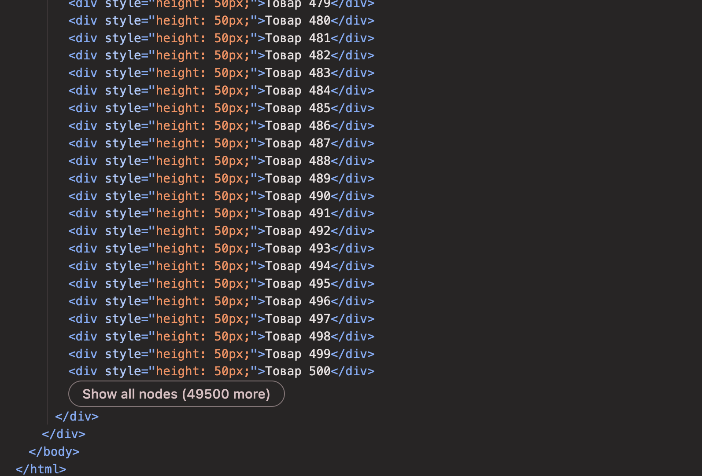
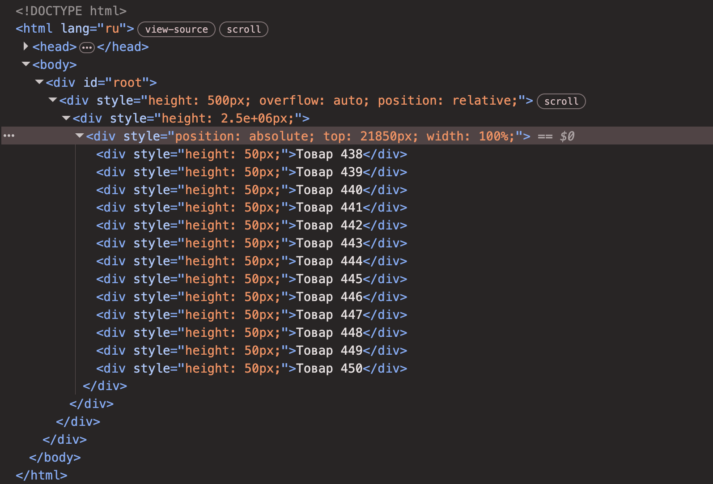
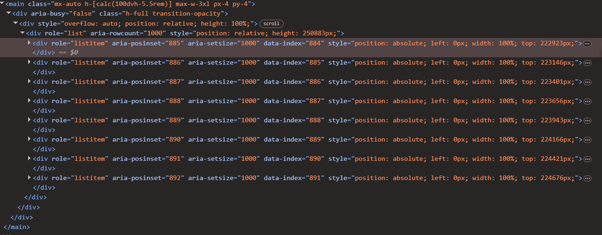

## [→ Открыть демо каталога](https://b2b.frontbench.tech)

Реализовано в рамках B2B-платформы по управлению дистрибуцией. Менеджер дистрибьютора собирает заказ из каталога в 50 000 товаров и работает с ними одним списком.

**Стек:** React · TypeScript · TanStack Query · Webpack · NestJS · Prisma · PostgreSQL · FSD · Docker

---

### Проблема:

**Было:** каталог рендерился целиком — браузер держал 50 000 DOM-узлов, страница подвисала:



### С виртуализацией, начало списка:

**Стало:** в DOM живёт только видимое окно из 4-8 карточек, данные грузятся порциями по 200 по мере скролла.
Вес данных не меняется от любого размера базы.

| Метрика                | Было    | Стало                  |
| ---------------------- | ------- | ---------------------- |
| DOM-узлов в списке     | 50 000  | **4–8** — видимое окно |
| Данные на первый экран | 26,5 МБ | **8,8 КБ**             |



**Та же страница, прокрученная вглубь:** список не растёт, окно смещается, узлы переиспользуются.



#### Lighthouse, при 4х замедленном процессоре:

| Метрика                               | Значение   | Порог «хорошо» |
| ------------------------------------- | ---------- | -------------- |
| Performance                           | **97**     | 90             |
| LCP — когда виден основной контент    | **1,49 с** | 2,5 с          |
| CLS — скачки вёрстки при загрузке     | **0**      | 0,1            |
| INP — отклик на действие пользователя | **40 мс**  | 200 мс         |

---

### Реализация:

**[VirtualList](client/src/shared/ui/virtual-list/index.tsx)** — компонент
**[products-list](client/src/pages/products-list/index.tsx)** — страница: данные и поиск
**[fetchProducts](client/src/entities/product/api/index.ts)** — запрос к API

---

### Ключевые технические решения

- Виртуализация с замером высоты карточки (`@tanstack/react-virtual`).
- Серверная пагинация на NestJS и Prisma.
- Дебаунс поиска.
- Отмена устаревших запросов.
- Деньги в копейках, целым `Int`.
- FSD архитектура.

---

### Запуск

Нужны Node 22+, pnpm и Docker:

```bash
cp .env.example .env     # переменные окружения
docker compose up -d     # PostgreSQL в контейнерах
pnpm install
pnpm db:setup            # схема БД и 50 000 тестовых товаров
pnpm dev                 # клиент и сервер вместе
```

Открыть `http://localhost:3000`.
API отвечает на `http://localhost:4000`.

Если нужно поднять в контейнерах всё, вместе с API:

```bash
docker compose -f docker-compose.yml -f docker-compose.app.yml up -d --build
```

### Тесты

```bash
pnpm --filter client test
```
